# Rivet — LBO / DCF Returns Calculator

<picture>
  <source media="(prefers-color-scheme: dark)" srcset="docs/img/hero-dark.svg">
  <source media="(prefers-color-scheme: light)" srcset="docs/img/hero-light.svg">
  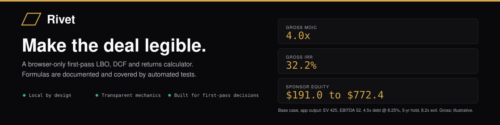
</picture>

**A browser-only, educational LBO / DCF / returns calculator that turns a handful of deal assumptions into an explainable first-pass returns view.**

<p>
  <a href="https://heykav.github.io/pe-financial-calculator/"></a>
  &nbsp;&nbsp;
  <a href="#run-locally"></a>
  &nbsp;&nbsp;
  <a href="LICENSE"></a>
  &nbsp;&nbsp;
  <a href="https://github.com/heykav/pe-financial-calculator/blob/main/.github/CONTRIBUTING.md"></a>
</p>

I got tired of rebuilding the same six-input LBO in a fresh spreadsheet every time someone said "just give me a rough sense of the deal," so I built the rough sense as a web page instead. Type in the purchase price, EBITDA, leverage, and a five-year forecast; Rivet gives you MOIC, IRR, and — more usefully — *why*: how much of the return is the business actually growing versus you just paying down debt versus the exit multiple being kind to you.

Every workspace opens with a plain-English "start here" line before the numbers, on the theory that the fastest way to lose someone in finance software is to show them a DCF before you've told them what a DCF is for.

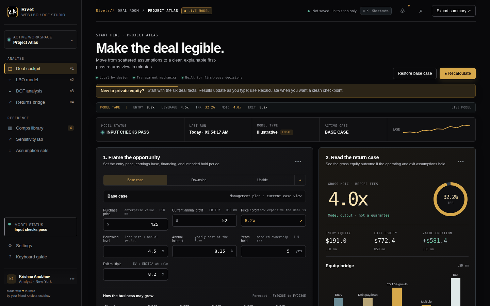

*The Base case: 4.0x gross MOIC / 32.2% gross IRR (headless-Chromium render of the real app).*

**What this is:** a transparent, browser-only first-pass LBO / DCF / returns calculator whose formulas are documented in [`docs/formulas.md`](docs/formulas.md) and covered by automated tests against hand-computed values.

**What this is not:** a deal-grade underwriting model, a full three-statement model, a tax model, or a source of market data. Returns are gross and simplified: no taxes, no fund fees or carry, a single debt tranche, and cash flow approximated as a flat 65% of EBITDA. See [Model assumptions and limitations](#model-assumptions-and-limitations).

> Rivet is illustrative. It is not investment advice, a valuation opinion, or a stand-in for real diligence — treat every output as a first-pass conversation starter, not a number to base a decision on.

## Screenshots

Captured with headless Chromium from the running app at its default inputs, the documented base case: EV $425mm, EBITDA $52mm, 4.5x debt at 8.25%, 5-year hold, 8.2x exit, revenue growth 12/11/10/9/8% and EBITDA margin 21% rising to 25%. That set gives 4.04x gross MOIC and 32.2% gross IRR (model.js). Nothing below is mocked. Click an image for full size. The screenshots predate a wording pass: the buttons now read "Recalculate" and "Export summary" where the images show "Run underwriting" and "Export memo".

| View | Desktop, 1440x900 | Mobile, 390x844 |
| --- | --- | --- |
| LBO returns (deal cockpit, base case) | <a href="docs/img/app-lbo-returns-desktop.png">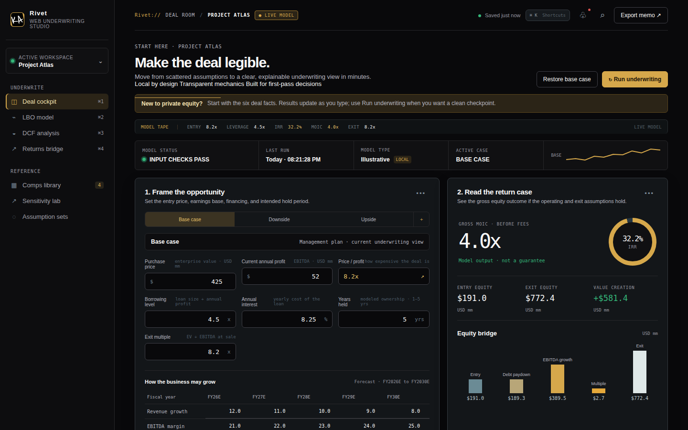</a> | <a href="docs/img/app-lbo-returns-mobile.png">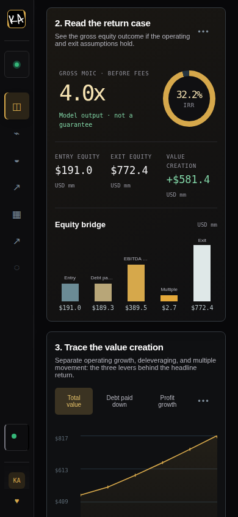</a> |
| Sensitivity (gross IRR by exit multiple and EBITDA growth; desktop shows the Sensitivity lab view, mobile the cockpit table) | <a href="docs/img/app-sensitivity-desktop.png">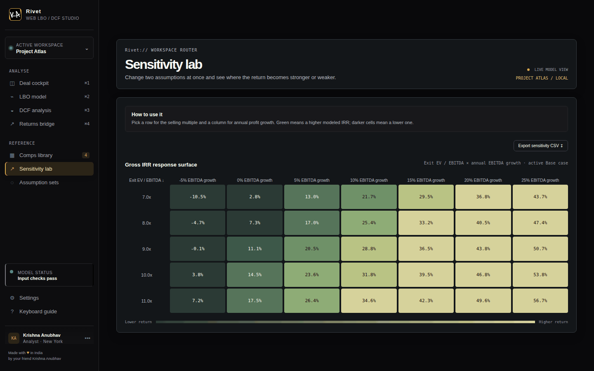</a> | <a href="docs/img/app-sensitivity-mobile.png">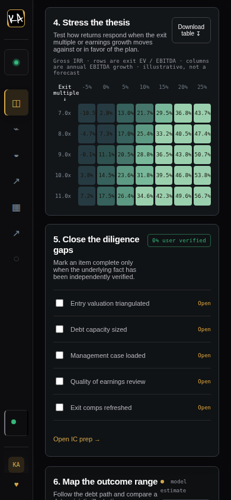</a> |
| DCF view | <a href="docs/img/app-dcf-desktop.png">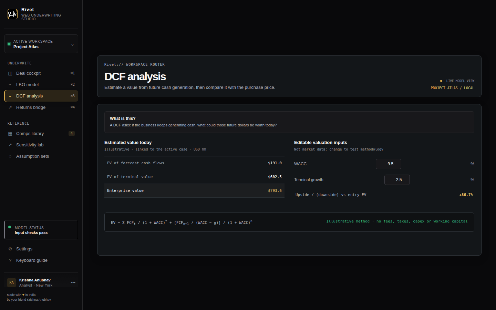</a> | <a href="docs/img/app-dcf-mobile.png">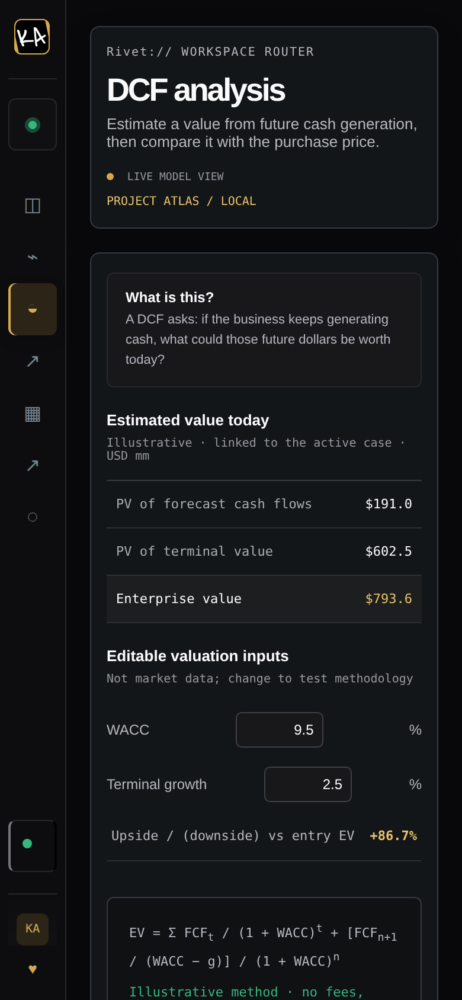</a> |
| Validation error (borrowing level set to 9.0x) | <a href="docs/img/app-validation-error-desktop.png">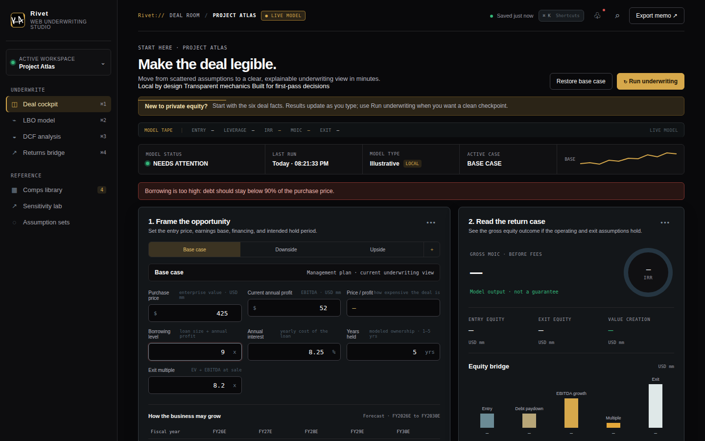</a> | <a href="docs/img/app-validation-error-mobile.png">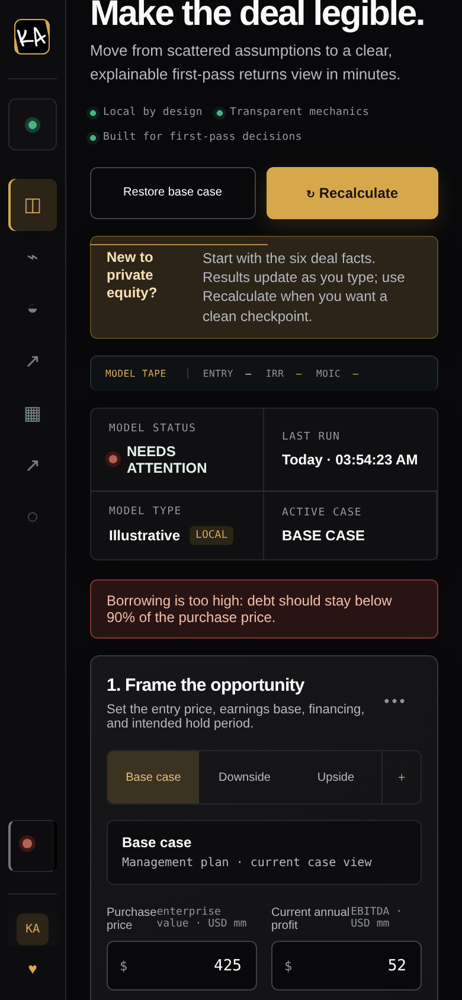</a> |

## How the numbers flow

Values in both diagrams are output of `model.js` at the base case above (USD mm); the formulas are in [`docs/formulas.md`](docs/formulas.md).

<picture>
  <source media="(prefers-color-scheme: dark)" srcset="docs/img/diagram-lbo-flow-dark.svg">
  <source media="(prefers-color-scheme: light)" srcset="docs/img/diagram-lbo-flow-light.svg">
  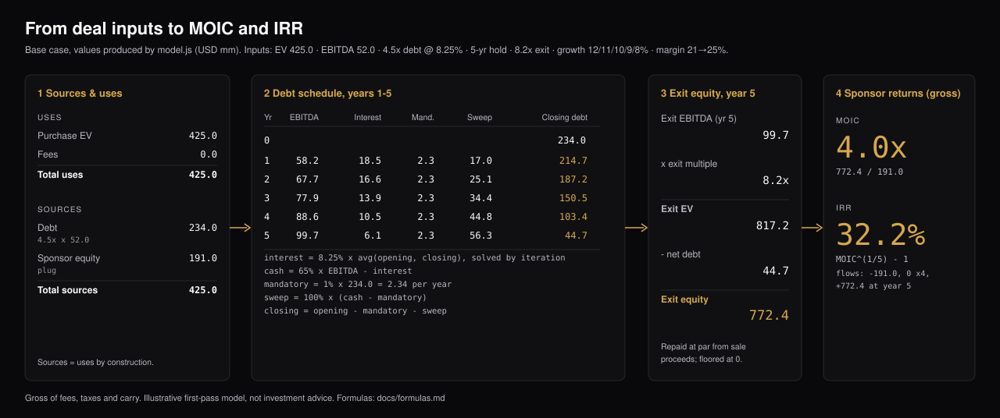
</picture>

<picture>
  <source media="(prefers-color-scheme: dark)" srcset="docs/img/diagram-returns-attribution-dark.svg">
  <source media="(prefers-color-scheme: light)" srcset="docs/img/diagram-returns-attribution-light.svg">
  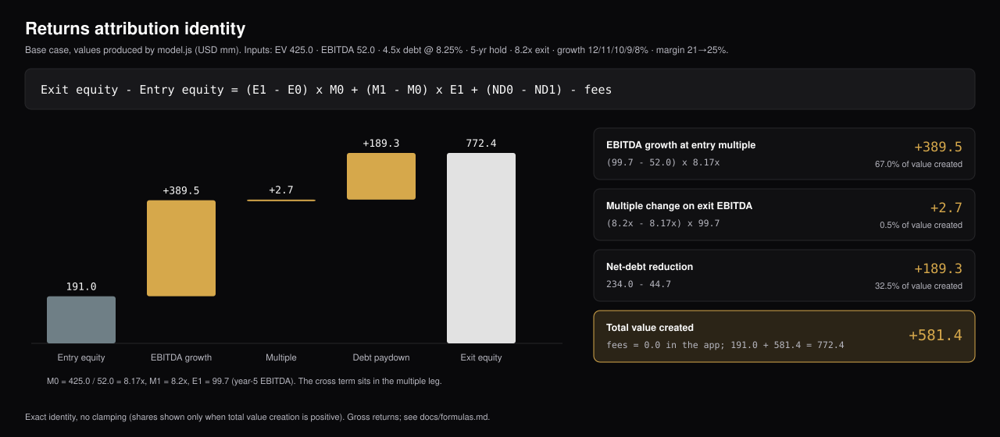
</picture>

## Table of contents

- [Screenshots](#screenshots)
- [How the numbers flow](#how-the-numbers-flow)
- [What the calculator does](#what-the-calculator-does)
- [Why Rivet exists](#why-rivet-exists)
- [Who it is for](#who-it-is-for)
- [How to use it](#how-to-use-it)
- [Model outputs](#model-outputs)
- [Workspaces](#workspaces)
- [Model assumptions and limitations](#model-assumptions-and-limitations)
- [Privacy and data handling](#privacy-and-data-handling)
- [Run locally](#run-locally)
- [Project structure](#project-structure)
- [Contributing](#contributing)
- [YC application brief](#yc-application-brief)
- [Independent project notice](#independent-project-notice)

## Why Rivet exists

The first pass at any deal is always the same fight: an Excel file that's
either a hand-me-down from someone who left the firm, or a blank sheet you
have to wire up yourself — debt schedule, IRR formula, sensitivity table,
the works — before you can even ask "is this worth a second look?"

Rivet is that first pass, pre-wired:

**assumptions → operating case → capital structure → returns → what to verify**

It doesn't pretend to replace real diligence or an investment committee —
see [`YC.md`](YC.md) for the fuller, more self-critical version of that
argument. Its actual job is smaller: get you from "I have
six numbers" to "here's what those six numbers imply" in under a minute,
so the fifteen-minute conversation about whether to keep going can happen
on solid ground.

## Web-only product boundary

Rivet is strictly a browser web app. Open it at the hosted URL or serve the
static files locally; no native desktop or mobile wrapper, executable,
browser extension, account, backend, or installation step is part of the
product. The browser tab is the runtime and the source of truth for model
state. Responsive styling supports smaller browser windows, but does not
turn Rivet into a native application.

## What the calculator does

Rivet is an educational **finance calculator** for:

- **Leveraged buyout (LBO) analysis:** sources and uses, debt sizing, sponsor equity, debt paydown, exit equity, MOIC, and IRR.
- **Private equity returns analysis:** a clear separation between purchase price, operating performance, leverage, exit multiple, and value creation.
- **Investment banking case work:** a compact deal cockpit for interview preparation, learning, and first-pass what-if analysis.
- **DCF reference analysis:** an illustrative discounted cash flow bridge with present value of forecast cash flows, terminal value, WACC, and terminal growth.
- **Deal comps:** a small illustrative comparable-company table for valuation sense-checking.
- **Sensitivity analysis:** an IRR response surface across exit multiples and EBITDA growth assumptions.
- **Scenario analysis:** a lower / expected / higher IRR range set at fixed offsets from the point IRR (−6.6 and +9.3 percentage points). It is not a probability distribution.
- **Diligence tracking:** a self-serve checklist that distinguishes model outputs from facts that still need verification. Ticking a box records nothing beyond the current tab.

The app is intentionally browser-only. There is no login, backend, analytics pipeline, native wrapper, or database. Assumptions are held in the page and can be changed without sending deal information to a server.

## Who it is for

Mainly: PE associates and IB analysts who need a first-pass number before a
real model exists, and students/operators who've never built an LBO and
would like to understand what one actually does before Excel hides the
mechanics behind fifty interlinked tabs. If you already have a live
three-statement model for this deal, you don't need Rivet — you need to
open that model.

The interface is also suitable for independent interview and case-study preparation involving investment banks, private equity firms, hedge funds, and financial institutions. It does **not** represent or reproduce the proprietary methods, data, branding, or internal tools of any employer, bank, fund, or data provider.

## How to use it

1. Open the [live Rivet calculator](https://heykav.github.io/pe-financial-calculator/).
2. In **Describe the deal**, enter:
   - Purchase price / enterprise value in USD millions.
   - Current annual EBITDA in USD millions.
   - Debt / EBITDA borrowing level.
   - Annual interest rate.
   - Modeled ownership period from one to five years.
3. Select **Base case**, **Downside**, or **Upside**.
4. Enter the five-year revenue-growth and EBITDA-margin forecast.
5. Review the return output, equity bridge, debt schedule, and sensitivity grid.
6. Mark diligence items as complete only when the underlying fact has actually been verified.
7. Use **Recalculate** for an explicit checkpoint, **Export summary** for a text summary, or **Download table** for the sensitivity CSV.

### The screen, in plain English

The application is organized from left to right:

1. **Deal cockpit:** enter the facts you know.
2. **Potential return:** see gross MOIC and IRR.
3. **Return drivers:** understand whether growth, debt paydown, or the exit multiple did the work.
4. **What-if analysis:** test different outcomes.
5. **Diligence checklist:** separate model assumptions from verified facts.
6. **Outcome range:** review the modeled debt path and return envelope.

The sidebar opens the deeper LBO, DCF, returns, comps, sensitivity, and assumption workspaces. Settings, Model status, and Keyboard guide are available at the bottom of the sidebar.

### Keyboard guide

- `⌘ / Ctrl + 1`: Deal cockpit
- `⌘ / Ctrl + 2`: LBO model
- `⌘ / Ctrl + 3`: DCF analysis
- `⌘ / Ctrl + 4`: Returns bridge
- `⌘ K`: Open the keyboard guide
- `Esc`: Close an open utility panel

### A useful first exercise

Try a hypothetical company with a `$600mm` purchase price, `$80mm` of EBITDA, `4.0x` debt / EBITDA, `7.5%` interest, and a five-year hold. Then compare the Base, Downside, and Upside cases. Change only one assumption at a time so the return bridge remains interpretable.

## Model outputs

### Entry valuation

`Entry multiple = Purchase price / EBITDA`

This is a simple entry enterprise-value-to-EBITDA multiple. It is not a substitute for a full capitalization table or normalized EBITDA analysis.

### Debt and sponsor equity

`Entry debt = EBITDA × Debt / EBITDA`

`Sponsor equity = Purchase price − Entry debt` (the app sets transaction fees to zero; `model.js` supports an entry-fee input that would be added to the equity cheque)

The calculator applies a sanity check that debt must remain below 90% of purchase price. This is a guardrail for the illustrative model, not a lending commitment or credit decision.

### Operating forecast

The cockpit accepts five annual revenue-growth and EBITDA-margin inputs. Forecast EBITDA is derived from the starting EBITDA and the entered growth and margin assumptions. Inputs are bounded to keep the browser model finite and interpretable:

- Revenue growth: above `−100%` up to `100%`.
- EBITDA margin: above `0%` up to `100%`.
- Hold period: one to five years.

### Exit value and returns

The current illustrative model uses a simple exit-multiple convention and a simplified debt-paydown schedule. It reports:

- Exit enterprise value.
- Exit debt and exit equity.
- Gross MOIC before fees, carried interest, taxes, and transaction costs.
- Annualized IRR derived from the modeled MOIC and hold period.
- Value creation split into debt paydown, EBITDA growth, and multiple movement.

IRR is computed as the root of the NPV of `[-equity, 0, ..., 0, exit equity]` by a bracketing solver (`irr()` in `model.js`); with no interim dividends this equals `MOIC^(1/hold) - 1`. The debt schedule is cash-flow based: 65% of EBITDA less interest (average balance, circularity solved iteratively), 1% mandatory amortisation and a 100% cash sweep. Exit multiple is an explicit input. See [`docs/formulas.md`](docs/formulas.md) for every formula, assumption and simplification.

### Sensitivity and scenarios

The sensitivity grid shows how illustrative IRR changes across exit multiples and EBITDA growth rates. The scenario panel presents a deterministic lower / expected / higher return envelope; it is a communication aid, not a Monte Carlo engine calibrated to historical market data.

## Workspaces

| Workspace | Purpose |
| --- | --- |
| Deal cockpit | Plain-English starting point for assumptions and headline returns. |
| LBO model | Live-linked sources & uses, sponsor equity, debt paydown, leverage metrics, and CSV export. |
| DCF analysis | Live-linked illustrative EBITDA forecast, editable WACC/terminal growth, formula bridge, and entry-value comparison. |
| Returns bridge | Gross/before-fees MOIC and IRR with EBITDA growth, debt paydown, and multiple-movement contributions. |
| Comps library | Filterable illustrative rows plus a current-entry-multiple versus illustrative-median sanity check (not market data). |
| Sensitivity lab | Dynamically calculated gross-IRR grid across exit multiple and EBITDA growth, with CSV export. |
| Assumption sets | Selectable Base, Downside, and Upside cases linked to cockpit inputs; local copy flow without backend persistence. |

## Model assumptions and limitations

Rivet is deliberately transparent about what it does not do. It currently does **not** provide:

- A complete three-statement financial model.
- A multi-tranche debt waterfall, covenants, or financing term sheet (a single-tranche schedule with 1% amortisation and a cash sweep is modelled).
- A tax model, working-capital schedule, capex schedule, or purchase-accounting model. Cash available for debt service is a flat 65% of EBITDA, before interest.
- Any bridge from enterprise value to equity price: the purchase price is treated as a cash-free, debt-free enterprise value.
- Interest income on cash, a revolver, or a minimum cash balance. If cash flow does not cover interest and mandatory amortisation, the shortfall is added to the same debt balance and the app shows a warning.
- A full three-statement DCF, market-data-backed comps database, or live market feed. The DCF is a simplified illustrative FCF proxy and comps are intentionally illustrative.
- Real-time market data, lender quotes, public filings, or proprietary research.
- Fund-level waterfall economics, management options, fees, carried interest, or preferred equity.
- A statistically calibrated Monte Carlo simulation or any probability distribution of outcomes.
- Automated tests of the browser interface: the 21 tests cover `model.js` only.

Treat the outputs as a structured first-pass conversation starter. Replace illustrative data with diligence-backed forecasts before relying on any result.

## Privacy and data handling

Rivet runs as static HTML, CSS, and JavaScript. It does not require an account and does not transmit entered assumptions to an application server. Do not enter confidential, material non-public, personally identifiable, or restricted client information into a public browser demo.

Read [`PRIVACY.md`](PRIVACY.md) for the deployment data boundary and GDPR/CCPA-oriented privacy controls. Read [`SECURITY.md`](SECURITY.md) for security reporting and OSINT boundaries.

## Run locally

The app has no runtime dependencies, framework, or build step (`package.json` exists only to run the tests):

```sh
git clone https://github.com/heykav/pe-financial-calculator.git
cd pe-financial-calculator
python3 -m http.server 4173
```

Open <http://localhost:4173>.

Run the calculation tests (Node 20+, no dependencies):

```sh
npm test
```

The browser preview is the source of truth for interaction testing. Keep the console free of errors and verify wide, medium, and narrow browser viewport layouts when changing UI code.

## Project structure

```text
.
├── index.html                 # Application shell, metadata, structured data, and UI
├── model.js                  # Pure calculation core (IRR, DCF, debt schedule, LBO)
├── app.js                    # UI state, routing, rendering, and interactions
├── test/model.test.js        # node --test suite vs hand-computed values
├── docs/formulas.md          # Every formula, assumption and simplification
├── docs/img/                 # Hero banner, diagrams (SVG dark/light), screenshots, social preview
├── styles.css                # Rivet design system and responsive layout
├── DESIGN.md                 # Visual language and component grammar
├── PRIVACY.md                # GDPR/CCPA-oriented privacy notice
├── SECURITY.md               # Vulnerability reporting, privacy/OSINT boundaries, operating practices
├── LICENSE                   # All rights reserved
├── package.json              # `npm test` only; no runtime dependencies
├── favicon.jpeg              # Rivet browser icon and KA mark
├── YC.md                     # Product brief and YC-style company narrative
├── robots.txt                # Crawler guidance
├── sitemap.xml               # GitHub Pages sitemap
└── .github/
    ├── CONTRIBUTING.md       # Contribution workflow
    ├── dependabot.yml        # Weekly updates for npm and GitHub Actions
    ├── ISSUE_TEMPLATE/       # Bug report template
    └── workflows/            # ci.yml (tests on push/PR), pages.yml (deployment)
```

## Contributing

If you can point out where a formula is wrong or a boundary case breaks,
that's worth more to this repo than a feature PR. Bug reports, model-review
notes, and focused pull requests are welcome — start with an
[issue](https://github.com/heykav/pe-financial-calculator/issues/new/choose)
if you want to talk it through first.

Before opening a pull request:

1. Explain the user problem and the smallest complete change.
2. Keep financial formulas explicit and document any new assumption.
3. Preserve finite outputs for invalid and boundary inputs.
4. Test case switching, exports, workspace routing, and responsive layout when relevant.
5. Do not add tracking, credentials, confidential deal data, or unsupported claims.
6. Include before/after screenshots for meaningful visual changes.

See [`.github/CONTRIBUTING.md`](.github/CONTRIBUTING.md) for the repository standards.
See [`SECURITY.md`](SECURITY.md) for the privacy boundary, vulnerability
reporting guidance, and ISO/IEC 27001-aligned controls.

## YC application brief

[`YC.md`](YC.md) is the honest version of the pitch: the problem, why a
six-input browser calculator can be a wedge instead of a toy, and — just
as importantly — what it deliberately doesn't claim yet.

## Independent project notice

Rivet is independent, not affiliated with or endorsed by any bank, fund,
or employer. Mentions of PE/IB/hedge-fund workflows are descriptive
context for who finds this useful, not a claim of association.

## License

All rights reserved — see [`LICENSE`](LICENSE). Published for viewing and
portfolio evaluation; see [`.github/CONTRIBUTING.md`](.github/CONTRIBUTING.md)
for contribution terms.

---

Made with ❤️ in India by [Krishna Anubhav](https://github.com/heykav).
